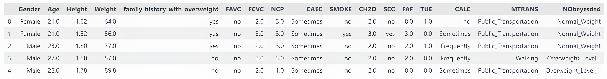
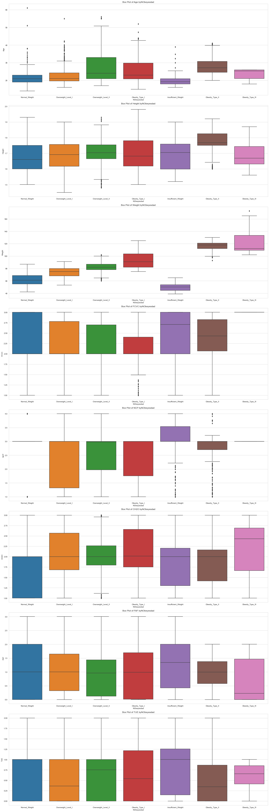
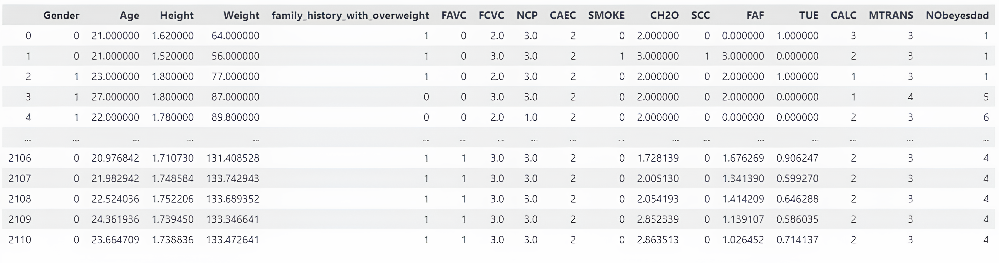
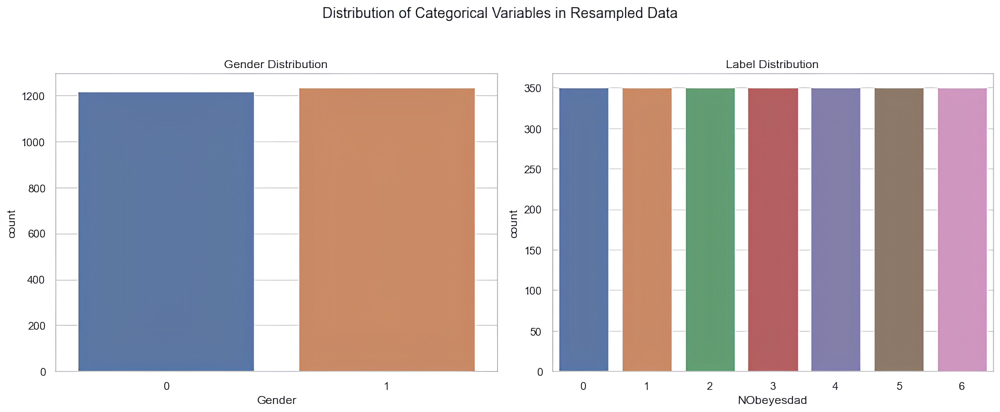
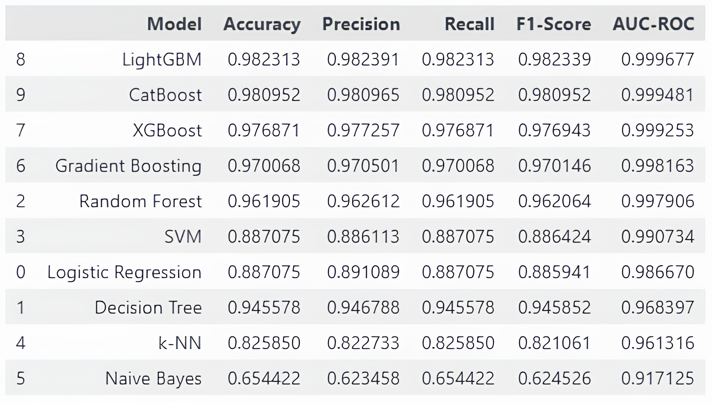
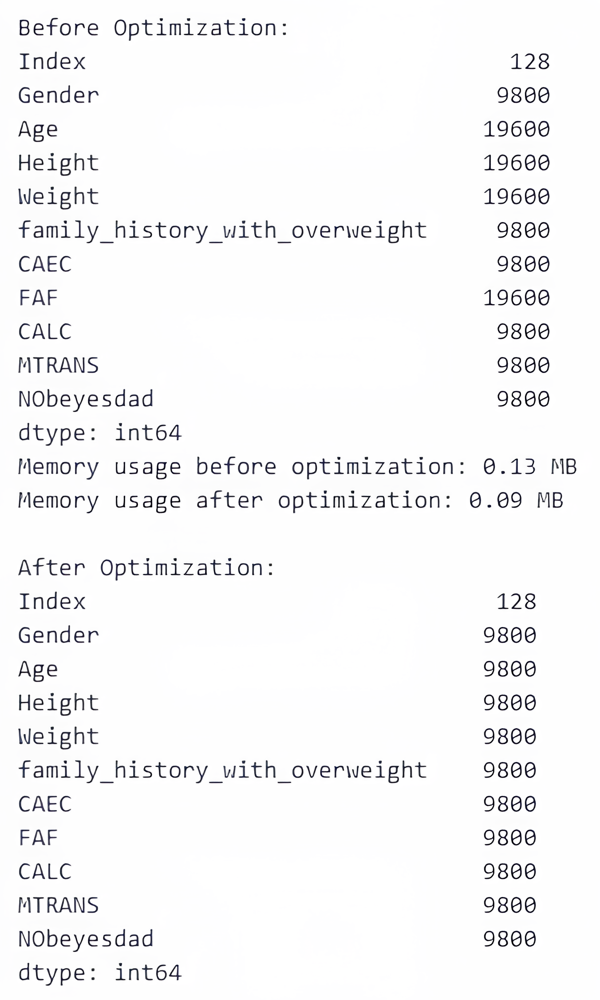

# Obésité

L'obésité et le surpoids se définissent par une accumulation excessive ou anormale de graisse corporelle représentant un risque pour la santé. Un indice de masse corporelle (IMC) supérieur à 25 est considéré comme du surpoids, tandis qu'un IMC au-delà de 30 relève de l'obésité, selon l'Organisation mondiale de la santé. Ce phénomène a pris une ampleur alarmante, contribuant à plus de 4 millions de décès en 2017, d'après le Global Burden of Disease.

## **Pour Exécuter le projet**

```
git clone https://github.com/OrensObenas/Coding_week.git
```

*Pour lancer le projet en local*

```
cd Coding_week
```

NB: Dans le cas le requirement ne marche pas, veuillez à créer un environnement virtuel et ajouter tout les modules nécessaire pour le machine learning et django
```
pip install -r requirements.txt
```
```
cd DjangoDeployement
```
```
python manage.py runserver
```
---

## Classification de l'obésité

### Objectif

Cette étude vise à analyser les niveaux d'obésité en se basant sur les habitudes alimentaires et la condition physique des individus. Nous réaliserons une analyse exploratoire des données (EDA) pour mieux comprendre le jeu de données, appliquer différents algorithmes de classification en apprentissage automatique et comparer leurs performances prédictives.

Les données utilisées proviennent du jeu de données *Estimation of obesity levels based on eating habits and physical condition* issu de l'UCI Machine Learning Repository. Ce jeu de données rassemble des informations variées, telles que les habitudes alimentaires, l'activité physique, et les facteurs socio-démographiques, permettant une évaluation précise des niveaux d'obésité.




### Colonnes du jeu de données

1. **Gender** : Sexe de l'individu (*Male* ou *Female*).
2. **Age** : Âge de l'individu (en années).
3. **Height** : Taille (en mètres).
4. **Weight** : Poids (en kilogrammes).
5. **family_history_with_overweight** : Antécédents familiaux de surpoids (*yes* ou *no*).
6. **FAVC** : Consommation fréquente d'aliments riches en calories (*yes* ou *no*).
7. **FCVC** : Fréquence de consommation de légumes (échelle de 1 à 3).
8. **NCP** : Nombre de repas principaux par jour (échelle de 1 à 4).
9. **CAEC** : Fréquence de consommation d'aliments entre les repas (*no, Sometimes, Frequently, Always*).
10. **SMOKE** : Consommation de tabac (*yes* ou *no*).
11. **CH2O** : Consommation quotidienne d'eau (échelle de 1 à 3).
12. **SCC** : Suivi des calories consommées (*yes* ou *no*).
13. **FAF** : Fréquence d'activité physique (en heures par semaine, échelle de 0 à 3).
14. **TUE** : Utilisation de la technologie (écrans, ordinateurs, etc.) (échelle de 0 à 2).
15. **CALC** : Fréquence de consommation d'alcool (*no, Sometimes, Frequently, Always*).
16. **MTRANS** : Mode de transport principal (*Automobile, Motorbike, Bike, Public_Transportation, Walking*).
17. **NObeyesdad** : Niveau d'obésité, la variable cible (*Insufficient_Weight, Normal_Weight, Overweight_Level_I, Overweight_Level_II, Obesity_Type_I, Obesity_Type_II, Obesity_Type_III*).

---

# Caractéristiques des données


## Data Shape
- L'ensemble de données comporte **2111 lignes** et **17 colonnes**.

## Data types
- **Gender**: object (categorical)
- **Age**: float (numerical)
- **Height**: float (numerical)
- **Weight**: float (numerical)
- **family_history_with_overweight**: object (categorical)
- **FAVC**: object (categorical)
- **FCVC**: float (numerical)
- **NCP**: float (numerical)
- **CAEC**: object (categorical)
- **SMOKE**: object (categorical)
- **CH2O**: float (numerical)
- **SCC**: object (categorical)
- **FAF**: float (numerical)
- **TUE**: float (numerical)
- **CALC**: object (categorical)
- **MTRANS**: object (categorical)
- **NObeyesdad**: object (categorical)

---

# Vérification des valeurs manquantes


## Missing or null values
- Il n'y a **aucune valeur manquante ou nulle** dans le jeu de données.

--- 

# Statistiques descriptives


## Variables numériques
Pour les colonnes numériques (âge, taille, poids, etc.), les statistiques classiques sont affichées :

- **Count** (2111 pour toutes les colonnes) : nombre d'observations.
- **Mean**  
  - Age : 24.31 ans  
  - Height : 1.70 m  
  - Weight : 86.59 kg  
- **Std** (écart-type, représentant la dispersion des données)  
  - Age : 6.35  
  - Weight : 26.19  
- **Min**  
  - Age : 14 ans  
  - Weight : 39 kg  
- **25% / 50% (median) / 75%** : quartiles (indiquent la répartition des valeurs).
- **Max**  
  - Age : 61 ans  
  - Height : 1.98 m  
  - Weight : 173 kg  

## Variables catégorielles
Pour les colonnes textuelles (sexe, antécédents familiaux, moyens de transport, etc.), nous avons :

- **Nombre de catégories**  
  - Gender : 2  
  - MTRANS : 5  
  - NObeyesdad : 7  
- **Modalité la plus fréquente**  
  - Gender : Male  
  - MTRANS : Public_Transportation  
- **Nombre d’occurrences de la modalité la plus fréquente**  
  - Gender : 1068 pour Male  

## Interprétation des données


- **Âge** : Les individus ont entre **14 et 61 ans**, avec une moyenne d'environ **24 ans**.  
- **Poids** : Les poids varient entre **39 et 173 kg**, avec une moyenne d'environ **86.6 kg**.  
- **Taille** : La taille médiane est de **1.7 m**, allant de **1.45 m à 1.98 m**.  
- **Sexe** : L'échantillon est légèrement biaisé vers les hommes (**1068 hommes sur 2111 individus**).  
- **Niveaux d'obésité** : Il y a **7 catégories différentes** d'obésité, avec la plus fréquente étant **Obesity_Type_I**.  
- 
---

# Distribution des variables


## Démographie et caractéristiques physiques
- **Age** : La distribution est **asymétrique à droite**, avec une majorité d'individus ayant entre **18 et 25 ans**. Peu de personnes ont plus de **40 ans**.  
- **Height (Taille)** : La distribution est **quasi-normale**, centrée autour de **1.7 m**. Les tailles extrêmes sont rares (**très peu en dessous de 1.5 m ou au-dessus de 1.9 m**).  
- **Weight (Poids)** : Distribution **bimodale**, avec un premier pic autour de **70-80 kg** et un second vers **100-110 kg**. Cela suggère la présence de **groupes distincts** dans le jeu de données, probablement reflétant différentes **catégories d'obésité**.  

## Habitudes alimentaires
- **FCVC (fréquence de consommation de légumes)** : Très **polarisée**, avec deux pics clairs à **2 et 3**. Cela montre que la plupart des gens consomment des légumes **modérément à fréquemment**. Peu de personnes en consomment rarement.  
- **NCP (nombre de repas principaux par jour)** : Forte concentration autour de **3 repas par jour**, un **modèle alimentaire classique**. Quelques cas extrêmes indiquent des personnes mangeant **1 ou 4 repas quotidiennement**.  
- **CH2O (consommation d'eau)** : La majorité boit environ **2 litres d'eau par jour**, bien qu'une partie importante en consomme **moins d’1 litre ou plus de 3 litres**.  

## Activité physique et habitudes numériques
- **FAF (fréquence d'activité physique)** : Distribution en **marches d'escalier**, avec des pics à **0, 1, 2 et 3 heures par semaine**. Beaucoup de personnes déclarent **aucune activité physique**.  
- **TUE (temps passé devant un écran)** : La majorité passe **0 ou 1 heure par jour** sur les écrans, avec **très peu de personnes allant jusqu’à 2 heures ou plus**.  

## Interprétation
- Les **habitudes alimentaires** semblent classiques (**3 repas/jour, consommation modérée de légumes**).  
- La **sédentarité** est marquée : **beaucoup ne font aucune activité physique** et passent **peu de temps devant les écrans** (ce qui pourrait refléter un biais dans les auto-déclarations).  
- Les **poids et tailles** suggèrent des **groupes distincts**, cohérents avec les **différentes catégories d’obésité** (**léger, modéré, sévère**).  

---

# Box Plots : Identification des valeurs aberrantes et répartition des variables numériques



## Analyse des valeurs aberrantes (outliers)

### 1. Age (Âge)
- **Insufficient Weight** : Quelques outliers dans la trentaine alors que la majorité a entre **18-25 ans**.  
- **Obesity Types I & II** : Outliers notables au-delà de **50 ans**.  

**Interprétation** : L'âge médian augmente avec le niveau d'obésité, reflétant une **accumulation progressive du poids avec le temps**. Les individus plus âgés peuvent signaler une obésité installée depuis longtemps.

### 2. Weight (Poids)
- **Normal & Overweight** : Peu de valeurs extrêmes, cohérence dans ces catégories.  
- **Obesity Type III** : Outliers au-delà de **160 kg**.  

**Interprétation** : Les valeurs extrêmes reflètent des **cas d'obésité morbide**, qui peuvent fausser les moyennes et masquer les tendances générales.

### 3. NCP (Nombre de repas par jour)
- **Insufficient Weight** : Outliers pour ceux ne prenant qu'**1 repas par jour**.  
- **Obesity Types I & II** : Certaines valeurs extrêmes montrent des personnes prenant **4 repas ou plus**.  

**Interprétation** : Les extrêmes révèlent des **comportements alimentaires irréguliers** : sous-alimentation drastique ou tendance au grignotage excessif.

### 4. FCVC (Consommation de légumes)
- **Insufficient Weight & Obesity Type III** : Grande variabilité, allant d'une consommation **très faible à très élevée**.  
- **Normal & Overweight** : Répartition plus stable, autour de **2-3 (modérée)**.  

**Interprétation** : Pas de lien direct entre l'obésité et la consommation de légumes, suggérant que **d'autres facteurs alimentaires jouent un rôle**.

### 5. CH2O (Consommation d'eau)
- **Insufficient Weight & Obesity Type III** : Outliers sous **1 litre** ou au-dessus de **3 litres par jour**.  

**Interprétation** :  
- Une **hydratation insuffisante** pour les sous-pondérés.  
- Une **surconsommation compensatoire** chez certains obèses.  
- Ne prend pas en compte les **boissons sucrées ou caloriques**.

### 6. FAF (Activité physique)
- **Insufficient Weight** : Certains outliers pratiquent plus de **3 heures/semaine**.  
- **Obesity Types II & III** : Plusieurs outliers montrent **0 heure/semaine**.  

**Interprétation** :  
- L'activité physique **diminue avec l'obésité**.  
- Certains **sous-pondérés surcompensent** par un excès de sport.

### 7. TUE (Temps devant les écrans)
- **Obesity Types II & III** : Des individus passent **plus de 2 heures par jour** devant les écrans.  

**Interprétation** :  
- Le **temps d'écran seul ne semble pas expliquer l'obésité**.  
- Combiné à une **faible activité physique**, il peut aggraver la sédentarité.


## Détection analytique des outliers

### 1. Age
- **Moyenne** : **40.13 ans**  
- **Outliers possibles** : Valeurs s'étendant bien au-delà, pouvant inclure des individus âgés dans les extrêmes.  

**Interprétation** : Les valeurs extrêmes en âge pourraient refléter des cas d'**obésité persistante chez les personnes âgées**.

### 2. Height (Taille)
- **Moyenne** : **1.66 m**  
- **Outliers** : Tailles très petites ou très grandes (**<1.5 m ou >1.9 m**).  

**Interprétation** :  
- Peut **indiquer des erreurs de saisie** ou des cas rares de **tailles atypiques**.

### 3. Weight (Poids)
- **Moyenne** : **85.84 kg**  
- **Outliers** : Valeurs dépassant largement **140-150 kg** (obésité morbide).  

**Interprétation** :  
- Ces outliers doivent être scrutés pour voir si ces individus présentent **d'autres facteurs de risque**.

### 4. FCVC (Fréquence de consommation de légumes)
- **Moyenne** : **2.34** (échelle de 0 à 3).  
- **Outliers** : Peu probables, sauf valeurs extrêmes (0 ou 3 systématiquement).  

**Interprétation** :  
- Pas de lien direct avec des outliers, mais une **faible consommation de légumes pourrait influencer le poids**.

### 5. NCP (Nombre de repas par jour)
- **Moyenne** : **2.59**  
- **Outliers** : Moins de **1 repas/jour** ou plus de **5 repas/jour**.  

**Interprétation** :  
- Les personnes obèses pourraient montrer **des comportements alimentaires très irréguliers**.

### 6. CH2O (Consommation d'eau)
- **Moyenne** : **1.88 litres/jour**  
- **Outliers** : Moins de **1L/jour** ou plus de **3L/jour**.  

**Interprétation** :  
- Une faible consommation peut refléter un **mode de vie déséquilibré**.  
- Une surconsommation peut être une tentative de **"compenser" une mauvaise alimentation**.

### 7. FAF (Activité physique)
- **Moyenne** : **0.83 heures/semaine**  
- **Outliers** : Déclarant **0 heure** ou, au contraire, plusieurs heures par jour.  

**Interprétation** :  
- Valeurs extrêmes représentant des styles de vie **très sédentaires ou hyperactifs**.

### 8. TUE (Temps passé devant les écrans)
- **Moyenne** : **0.22 heures (environ 13 min/jour)** — valeur très faible qui mérite vérification.  
- **Outliers** : Personnes passant **2-3 heures devant les écrans**.  

**Interprétation** :  
- Les personnes obèses pourraient présenter **des valeurs plus élevées dans cette variable**.

## Suppression des individus âgés de plus de 50 ans


---

# Count Plots


## 1. Répartition par genre (Gender)
- Femmes et hommes sont presque également représentés, avec une légère majorité masculine.  
**Interprétation** : L'échantillon est bien équilibré, donc les résultats ne devraient pas être biaisés par le genre.

## 2. Antécédents familiaux de surpoids (family_history_with_overweight)
- Une grande majorité des individus (environ 75%) ont des antécédents familiaux de surpoids.  
**Interprétation** : Cela suggère une forte corrélation possible entre l'obésité et les facteurs génétiques ou les habitudes alimentaires héritées.

## 3. Fréquence de consommation d'aliments hypercaloriques (CAEC)
- Snackless (sans grignotage) domine largement.  
- Très peu déclarent consommer des snacks "toujours" ou "fréquemment".  
**Interprétation** : Soit les gens sous-déclarent leur consommation de snacks, soit l'échantillon reflète un biais de réponse, car on s’attendrait à une plus grande variété.

## 4. Tabagisme (SMOKE)
- La grande majorité des participants ne fument pas.  
**Interprétation** : Le tabagisme semble peu représenté dans cet échantillon, mais cela pourrait aussi refléter des habitudes spécifiques à une région ou un groupe démographique.

## 5. Activité physique (SCC - surveillez votre consommation calorique)
- La majorité des personnes déclarent ne pas surveiller leur consommation calorique.  
**Interprétation** : Cela pourrait expliquer des tendances vers le surpoids, car un manque de contrôle calorique est souvent lié à une prise de poids involontaire.

## 6. Consommation d'alcool (CALC)
- "Parfois" est la catégorie dominante, suivie par "non".  
- Très peu de gens boivent fréquemment ou toujours.  
**Interprétation** : Une consommation modérée semble être la norme, mais il serait intéressant de voir si ceux qui boivent fréquemment ont un lien avec des niveaux plus élevés d'obésité.

## 7. Moyen de transport (MTRANS)
- Transport public est le plus utilisé, suivi par auto/moto et marche à pied.  
**Interprétation** : La dépendance aux transports publics et aux véhicules privés suggère un mode de vie potentiellement sédentaire, expliquant un risque accru d'obésité.

## 8. Niveau d'obésité (NObeyesdad)
- Les catégories sont assez équilibrées, avec une surreprésentation des Obesity_Type_I et Overweight_Level_II.  
**Interprétation** : L'échantillon couvre bien toutes les catégories de poids, mais il semble y avoir une concentration significative de personnes en surpoids ou obèses, ce qui est pertinent pour une étude axée sur l'obésité.

## Conclusion globale :
- La plupart des individus ont des antécédents familiaux de surpoids, ne surveillent pas leur apport calorique, et utilisent principalement des moyens de transport passifs — ce qui souligne un mode de vie peu actif.
- Les niveaux d'obésité sont bien représentés, avec une forte proportion d'individus en surpoids avancé ou obésité modérée.

---

# Label Encoding

Le Label Encoding est une technique de prétraitement utilisée pour convertir des variables catégorielles en valeurs numériques. Cette méthode attribue un entier unique à chaque catégorie, permettant ainsi aux modèles de machine learning de traiter ces données, car la plupart des algorithmes ne peuvent pas travailler directement avec des chaînes de caractères.  
Nous utiliserons cette technique pour convertir nos variables catégorielles en variables numériques.



---

# Correlation Matrix

La Correlation Matrix (ou matrice de corrélation) est un outil statistique qui permet de mesurer et visualiser les relations entre les différentes features de notre jeu de données. Chaque valeur dans cette matrice représente le coefficient de corrélation entre deux variables, allant de -1 (corrélation négative parfaite) à +1 (corrélation positive parfaite).

### Points
1. Une corrélation proche de 1 indique que lorsque l'une des variables augmente, l'autre a tendance à augmenter également (relation positive).
2. Une corrélation proche de -1 suggère qu'une variable augmente lorsque l'autre diminue (relation négative).
3. Une corrélation autour de 0 signifie qu'il n'y a pas de relation linéaire claire entre les deux variables.


### Clés de la matrice de corrélation :

#### Corrélation avec la variable "NObeyesdad" (niveau d'obésité) :
- **Weight (poids)** : 0.39 — Corrélation positive modérée, ce qui est attendu puisque le poids est directement lié au niveau d'obésité.
- **family_history_with_overweight** : 0.32 — Une corrélation notable, suggérant que l'obésité pourrait avoir une composante génétique ou liée aux habitudes familiales.
- **CAEC (consommation de snacks hypercaloriques)** : 0.33 — Cela indique qu’une consommation fréquente d'aliments caloriques est liée à des niveaux plus élevés d'obésité.

#### Facteurs moins corrélés avec l'obésité :
- **Age** : 0.23 — Légère corrélation, ce qui pourrait traduire une tendance à prendre du poids avec l'âge, mais ce n'est pas le facteur principal.
- **Height (taille)** : 0.04 — La taille n’a quasiment aucun impact direct sur le niveau d'obésité, ce qui est logique.
- **CH2O (consommation d'eau)** : -0.02 — Aucun lien significatif entre l'hydratation et l'obésité dans cet échantillon.

#### Corrélations notables entre autres variables :
- **Gender et Height** : 0.62 — Forte corrélation, ce qui reflète probablement le fait que les hommes dans l'échantillon sont en moyenne plus grands que les femmes.
- **Age et MTRANS (moyen de transport)** : -0.62 — Corrélation négative marquée, suggérant que les personnes plus âgées utilisent moins les moyens de transport actifs (comme la marche ou le vélo).
- **Weight et Height** : 0.46 — Corrélation modérée, logique puisque les personnes plus grandes ont tendance à peser plus.

#### Corrélations faibles ou négligeables :
- La majorité des variables liées aux habitudes alimentaires (FCVC, NCP, SMOKE, CALC) montrent de faibles corrélations avec le niveau d'obésité, suggérant que les facteurs les plus déterminants restent le poids, les antécédents familiaux et les habitudes alimentaires hypercaloriques.

---

# Suppression des variables susceptibles de biaiser les résultats

# SMOTE

Le déséquilibre des classes peut fortement impacter les performances du modèle. Pour pallier ce problème, nous avons utilisé la technique **SMOTE** (Synthetic Minority Over-sampling Technique). Cette méthode génère de nouvelles instances synthétiques pour la classe minoritaire, permettant ainsi de rééquilibrer le jeu de données et d'améliorer la capacité prédictive du modèle.




## Distributions catégoriques :

### 1. Genre (Gender Distribution)
- Les deux catégories (0 et 1) sont équilibrées, avec environ le même nombre d’observations (~1200 chacune).  
  **Interprétation** : Cela montre que SMOTE n’a pas affecté ce paramètre puisqu’il s’agit d’une variable binaire et non minoritaire.

### 2. Label (NObeyesdad)
- Toutes les classes de la variable cible sont maintenant équilibrées (~350 pour chaque classe, de 0 à 6).  
- Cela indique que SMOTE a bien généré des échantillons synthétiques pour les classes minoritaires, assurant une distribution uniforme des labels.  
- **Objectif** : Corriger le déséquilibre initial entre les différentes catégories d'obésité.


## Distributions numériques :

### 1. Âge (Age)
- La distribution reste globalement similaire à celle d’avant SMOTE, avec une concentration entre 15 et 30 ans.  
  **Interprétation** : SMOTE n’a pas perturbé la forme globale mais a pu ajouter des points synthétiques, rendant la distribution plus lisse.

### 2. Taille (Height)
- La distribution suit toujours une courbe normale centrée autour de 1.7m.  
  **Interprétation** : Les valeurs synthétiques ajoutées semblent cohérentes avec la structure des données originales.

### 3. Poids (Weight)
- On note des pics autour de 60-80kg, et un deuxième entre 100-120kg.  
  **Interprétation** : SMOTE a probablement densifié les intervalles correspondant aux classes minoritaires liées à des poids plus élevés (associés aux catégories d'obésité).

### 4. IMC (BMI)
- La distribution montre deux modes clairs :  
  - Un autour de 20-25 (zone de poids "normal").  
  - Un autre vers 30-40 (zone de surpoids/obésité).  
  **Interprétation** : SMOTE a permis d’ajouter des valeurs synthétiques dans les tranches les plus rares (IMC très élevé ou très bas).

---

# Machine Learning Algorithms

### **Modèles testés**  
Nous avons évalué plusieurs algorithmes :  
- **Random Forest Classifier**  
- **CatBoost Classifier**  
- **LightGBM Classifier**  
- **Decision Tree**  
- **Logistic Regression**  
- **Support Vector Machines (SVM)**  
- **k-Nearest Neighbors (k-NN)**  
- **Gradient Boosting**  
- **Naive Bayes**  



## Analyse des résultats :

### 1. Modèles les plus performants :
- **Random Forest** a la meilleure précision globale (Accuracy = 99.04%), avec des scores presque parfaits pour toutes les autres métriques.
- **CatBoost** suit de très près, avec une Accuracy de 98.91% et le meilleur score AUC-ROC (0.999924), ce qui montre qu'il distingue très bien les classes.

### 2. Modèles Boostés :
- **LightGBM** et **XGBoost** affichent aussi d'excellents résultats (près de 99% pour toutes les métriques), prouvant la puissance des algorithmes basés sur les arbres décisionnels boostés.

### 3. Modèles classiques :
- **SVM (Support Vector Machine)** a des scores légèrement plus bas (Accuracy = 92.92%), ce qui suggère qu'il pourrait avoir du mal avec des données complexes ou mal séparables.
- **Naive Bayes** et **Logistic Regression** obtiennent des résultats corrects (entre 91% et 92%) mais restent en retrait par rapport aux modèles boostés.

### 4. Modèles les moins performants :
- **k-NN** est clairement le modèle le moins performant ici, avec une Accuracy de 85.3% et un AUC-ROC de 0.97. Cela peut indiquer qu'il est sensible au bruit ou que les données ne sont pas optimales pour ce type de modèle.

### 5. Équilibre précision/recall :
- Tous les meilleurs modèles maintiennent un équilibre entre **Precision** et **Recall**, ce qui est essentiel pour minimiser à la fois les faux positifs et les faux négatifs.

### 6. AUC-ROC :
- Cette métrique étant proche de 1 pour tous les modèles boostés, cela indique qu'ils séparent efficacement les classes et qu’ils sont particulièrement bien adaptés à cette tâche.


## Conclusion :
Les modèles boostés (**Random Forest**, **CatBoost**, **XGBoost**, **LightGBM**) dominent le classement, suggérant qu'ils gèrent très bien la complexité des données et minimisent les erreurs. Pour un compromis entre rapidité et précision, **Random Forest** et **CatBoost** semblent les choix les plus robustes.  
Pour la suite, nous avons choisi **CatBoost**.

---

# Optimization

L'optimisation de la mémoire est essentielle pour gérer efficacement de grands volumes de données. Dans cette section, nous avons mis en place une stratégie de réduction de la taille des colonnes numériques et catégorielles. Cela permet non seulement de minimiser l'empreinte mémoire, mais aussi d'accélérer les calculs sans compromettre la précision des résultats.




### Avant optimisation :
- **Mémoire totale** : 0.21 MB pour 19,600 lignes.
- Les colonnes numériques étaient stockées en `float64` — ce qui prend plus de place qu’il n’en faut.
- Les colonnes textuelles (comme les catégories) étaient au format `object`, ce qui utilise beaucoup de mémoire pour stocker les chaînes de caractères.

### Optimisations appliquées :
1. **Conversion des flottants** :
   - Les `float64` ont été convertis en `float32` — cela réduit de 50% la mémoire utilisée par ces colonnes.
   - **Utilisation** : parfait pour des variables comme `Weight`, `Height` et `BMI` où une précision à la virgule est nécessaire, mais `float64` est souvent surdimensionné.
   
2. **Conversion des colonnes catégoriques** :
   - Les colonnes de type `object` (comme `family_history_with_overweight` ou `MTRANS`) ont été converties en `category`.
   - **Gain** : cela réduit la mémoire en encodant chaque catégorie comme un entier au lieu de stocker chaque chaîne de caractères, surtout si le nombre de catégories est faible comparé à la taille totale du dataset.

### Après optimisation :
- **Mémoire totale** : 0.10 MB — réduction de 52%.
- **Nombre de lignes** : réduit à 9,800.
- Les colonnes numériques et catégoriques utilisent désormais le type de données le plus léger possible sans perte de précision.

---

# SHAP Explainability

Comprendre le fonctionnement interne d'un modèle d'apprentissage automatique est fondamental pour en garantir la fiabilité. Grâce aux valeurs **SHAP** (SHapley Additive eXplanations), nous pouvons expliquer l'impact de chaque variable sur les prédictions du modèle. Cette transparence nous permet d'identifier les caractéristiques les plus influentes et d'ajuster nos approches en conséquence.


### Interprétation globale des résultats :
#### 1. Importance des caractéristiques (SHAP values)
- **Feature 9** a le plus grand impact sur les prédictions du modèle, avec une contribution significative pour toutes les classes.
- **Feature 3** et **Feature 0** suivent avec une importance notable, bien qu'elles aient un impact globalement moindre que **Feature 9**.
- Les autres caractéristiques (**Feature 5**, **Feature 8**, **Feature 7**, etc.) ont un impact marginal, ce qui signifie qu'elles influencent peu les prédictions du modèle.

#### 2. Interprétation par classe
- Chaque barre colorée montre l’impact moyen des variables sur les prédictions pour chaque classe (de **Class 0** à **Class 6**).
- Par exemple, **Feature 9** joue un rôle crucial dans toutes les classes, tandis que certaines caractéristiques comme **Feature 5** n'ont presque aucun effet, quel que soit le groupe.

---

# **Insights du Prompt Engineering**  

### **Comment le prompt engineering a-t-il été utilisé ?**  
Nous avons exploité le **prompt engineering** pour optimiser l’analyse des données et la génération de code.  

#### **Exemples d’optimisation :**  
1. **Optimisation de la gestion de la mémoire** → Génération d’une fonction d’optimisation automatique des types de données.  
2. **Détection des outliers** → Génération d’un script efficace basé sur l’IQR et le Boxplot via un prompt dédié.  
3. **Interprétation avec SHAP** → Création de visualisations claires et explicites des résultats SHAP grâce à des prompts bien conçus.  
---
